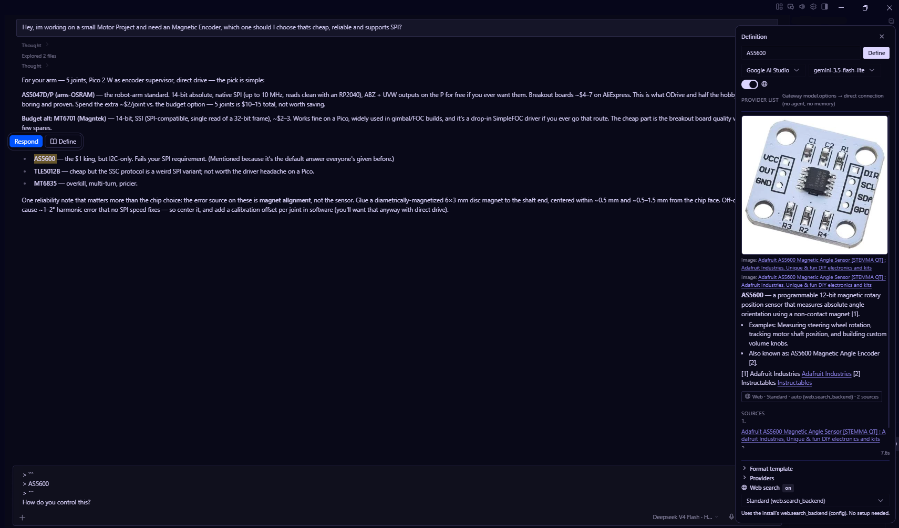

# Insight - Selection & Definition for Hermes Desktop
<p align="center">
  <picture>
    <source media="(prefers-color-scheme: dark)" srcset="assets/insight-banner-dark.png">
    
  </picture>
</p>

Insight is a two-part plugin for **Hermes Desktop** that turns any selected text
into an immediate definition. Select a word anywhere in the app, hit **Define**
in the popup, and a right-docked panel streams an answer from the provider of
your choice - with web search results, inline-cited sources, and thumbnails.
The same popup offers **Respond**, which inserts the selection into the
composer as a quoted reply. It is fast by design: stateless completion, the
format template as the only system instruction, reasoning off.

- **Renderer plugin** - a single `plugin.js`. Selection popup (Respond +
  Define), definition panel, markdown rendering.
- **Backend plugin** - a Python backend plugin that runs inside the
  gateway where your providers live. It resolves the provider list from your
  install config, does web search honoring `web.search_backend`, and streams
  the completion.

Plugin ids: `insight` (renderer), `insight-backend` (backend).

---

## What you get

Select any text in Hermes Desktop and a small popup appears with two actions:

- **Respond** - inserts the selection into the composer as a quoted
  (`>`) reply, so you can answer it in line.
- **Define** - opens the side panel and streams a definition of the selected
  term from the provider of your choice.



---

## Installation
```git clone https://github.com/BrokeSkill/Insight```

# Automatic
### Hermes Install (paste this into a Hermes Session)
```
Clone the GitHub repository located at https://github.com/BrokeSkill/Insight and follow the installation instructions outlined in the README.md file. Ensure that both the renderer and the backend are installed completely and correctly.
```
OR
### Run automated install script
(automatically checks your OS and install directory)
```bash
python install.py
```

# Manual
### 1. Renderer plugin (where Hermes Desktop runs)

1. Find your Hermes desktop plugins folder:
   `%LOCALAPPDATA%\hermes\desktop-plugins\`
2. Create a folder for the plugin and copy the renderer file into it:

   ```
   desktop-plugins\insight\plugin.js
   ```

3. Restart Hermes Desktop / Reload Desktop Plugins.

### 2. Backend plugin (the gateway host)

1. Find your Hermes plugins folder: `~/.hermes/plugins/` (Linux) or
   `%LOCALAPPDATA%\hermes\plugins\` (Windows).
2. Create the backend plugin folder and copy both files into it:

   ```
   plugins\insight-backend\
       __init__.py      ← copy from backend-plugin/__init__.py
       plugin.yaml      ← copy from backend-plugin/plugin.yaml
   ```

3. Enable it:

   ```bash
   hermes plugins enable insight-backend
   ```

   OR add `insight-backend` to the `plugins.enabled` list in
   `config.yaml` next to any existing entries.

4. Restart the gateway (`hermes gateway restart`).

### 3. Verify

```bash
hermes insight --sse-url           # prints the streaming endpoint
hermes insight --list-providers    # prints every provider from your config
```

The renderer discovers the endpoint automatically (`--sse-url`), so no manual
URL config is needed. If the panel's SSE fetch fails (e.g. the gateway started
before the plugin existed), the CLI command spawns a detached daemon that owns
the streaming server, so it works even without a gateway restart.

---

## How it works

**Flow:**

1. You select text in Hermes Desktop → a small popup appears with **Respond**
   and **Define**.
2. **Respond** quotes the selection into the composer (`> ...`).
   **Define** asks the gateway for the provider list once (`model.options`)
   and streams the completion over SSE from the backend's HTTP server (bound
   on the gateway host).
3. The backend (optional) runs a web search via `web.search_backend`, attaches
   images, then posts a **stateless** chat completion to the chosen provider:
   - system message = **the format template only** (no memory, no skills, no agent)
   - `reasoning_effort: none` for OpenAI-compatible/local proxies.
   - **no tools** - definitions cite the search sources inline instead
4. The response streams into the panel token by token; sources render with
   citations and images.

**Streaming server:** a small stdlib HTTP server (`0.0.0.0:8643`, SSE). If the
gateway process predates the plugin install, the CLI command spawns a detached
daemon that hosts it, so streaming works across machines without a gateway
restart.

---

## Configuration

Everything comes from your normal Hermes config.

- `model.base_url` / `model.default` - session model + default
- `providers.*` / `custom_providers.*` - the provider list shown in the dropdown (SELF CONFIGURABLE, OPTIONAL)
- `web.search_backend` + `web.searxng_url` / `web.search_url` - search + images
- `web.extract_backend` - used by search/extract

The panel lets you pick a provider/model per lookup; "Session model (current
chat)" uses whatever model you're chatting with.

---

## ToDo / Planned
- Ask-Window inside the Definition-Panel

---

## License

MIT - see [LICENSE](LICENSE). Forks and modifications are welcome and
permitted; the original author (BrokeSkill) must be attributed.

© 2026 BrokeSkill
